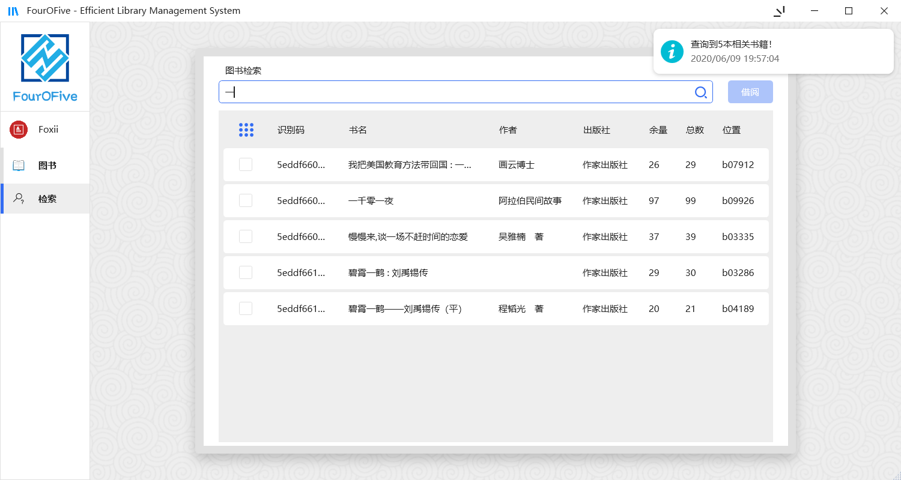

# FourOFive

FourOFive 是界面友好的图书馆管理系统 & 软件工程 & 数据库课程设计

## 特性

✔ 可配置的用户信誉系统；

✔ 客户端服务端一体

✔ 日志记录；

✔ 基于事务的业务处理；

✔ SQL参数化查询；

✔ 支持 MySql/SqlServer/PostgreSQL/Oracle/Sqlite；

## 系统要求

### 开发环境

IDE: Visual Studio 2019

平台: .NET Framework 4.8

语言: C# 8.0

代码仓库&版本控制: [GitHub](https://github.com/xlfqiji/FourOFive "FourOFive")

GUI框架: WFP

### 主要依赖

MVVM框架: [Caliburn.Micro](https://caliburnmicro.com/)

ORM SQL框架: [FreeSQL](https://github.com/2881099/FreeSql)

WPF控件库: [HandyControl](https://github.com/NaBian/HandyControl)

PBKDF2加密模块: [Microsoft.AspNetCore.Cryptography.KeyDerivation](https://github.com/aspnet/AspNetCore/tree/67e04394e98d5bfa6a5684d471a72fcbe30fd587)

Json模块: [Newtonsoft.Json](https://www.newtonsoft.com/json)

日志模块: [Serilog](https://serilog.net/)

以及以上模块的依赖和一些系统库

### 运行环境

平台: .NET Framework 4.8

以及以上依赖库(DLL在同一目录下即可)

**数据库:**

> 以下数据库有一种即可，其中SQLite为内置数据库，即软件无需任何外部数据库亦可使用

MySQL 5.6

SQLite 3.0

Oracle 11

PostgreSQL 9.5

SQLServer 2005+

## 快速开始

开箱即用，双击运行主程序(LibraryManagementSystem.exe)即可

第一次运行程序将会自动创建:

> 配置文件(config.json)
>
> 日志文件(logs/*)
>
> SQLite数据库文件(data.db)

此时打开日志文件你将会看到一条报错:

以编码System.Text.UTF8Encoding读取配置文件config.json时出错

这是正常现象

由于无配置文件，程序按默认配置使用SQLite，并创建了数据库文件data.db

如果你不打算使用SQLite，可以在配置好数据库信息后删除这个文件

## 界面展示

### 登陆

### 图书检索&借阅

### 图书归还

### 借阅记录

